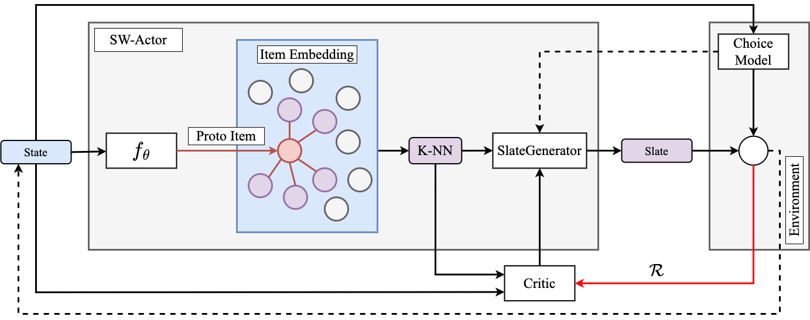

# Reinforcement Learning Recommender Systems
Developers: 
- Aayush Singha Roy (aayush.singharoy@insight-centre.org) 
- Edoardo D'Amico (edoardo.damico@insight-centre.org)
---

--- 

# Repository setup
To setup the repository clone the github link and run command poetry install from the IDE terminal which will create the .venv file. Ensure that the python environment setup points to python in the.venv file which is in .venv/bin/python
# Document Sampler
The documentsampler.py in src/recsys/document_modelling is used to sample candidate documents at the start of the episode for each user.

# User Dynamics
The user state and interest update at each step as described in the paper is carried out in src/recsys/user modelling/user_state.py . At the start of training the N number of users are generated using user_sampler which is in src/crecsys/user modelling/user_model.py

# Running Experiments
SlateQ -  To run slateq as described in the paper navigate to src/scripts/simulation/topic_run_simulation.py with the seeds as there in the config.yaml file description just after this.
SlateWolpertinger - To run slatewolpertinger set the nearest neighbour to the percentage of num_candidates (candidate documents as mentioned in the paper) in the config.yaml file. 

# Reproducibility
To ensure reproducibility set the parameters in config.yaml file as mentioned below:
parameters:
  ######## User related parameters ########
  resp_amp_factor: 1.0
  state_model_cls: ObservedUserState
  choice_model_cls: DotProductChoiceModel
  response_model_cls: WeightedDotProductResponseModel
  ######## Environment related parameters ########
  num_users: 5000
  sess_budget: 200
  slate_size: 5
  num_item_features: 20
  num_candidates: 300
  num_user_features: 20
  alpha_response: 0.25
  ######## Training related parameters ########
  replay_memory_capacity: 10000
  batch_size: 30
  gamma: 1.0
  tau: 0.0001
  lr: 1e-4
  num_episodes: 10000
  warmup_batches: 1
  device: "cpu"
  ######## Models related parameters ########
  slate_gen_model_cls: TopKSlateGenerator
  ######## Wolpertinger policy ########
  nearest_neighbours: 15
  ######## Seed ########
  seeds: [5, 7, 42, 97, 53]

  # Test setup
  To run the test set the user_seed as 11 in the files which are in the directory src/scripts/serving_tests for both slateQ and slatewolpertinger in file slateq_test.py and wa_test.py respectively.
  
  # Serving time
  To check the serving time for both the models run slateq_serving_time.py and wa_serving_time.py in the path src/scripts/serving_tests

  # Plotting scripts
  For convergence plot refer to src/plotting_scripts/plot_convergence.ipynb. Load all the 5 trained models for 5 seeded runs and will directly plot convergence for cumulative satisfaction as mentioned in the paper.
  For time plot similarly refer to src/plotting_scripts/serving_time.ipynb
  To do significance testing load the models saved after running test in slateq_test.py and wa_test.py. Load them to src/plotting_scripts/test_significance.ipynb and conduct student t-paired test as it loads for all the 5 different test results.

  For any clarification drop a mail to the developers.
 
 